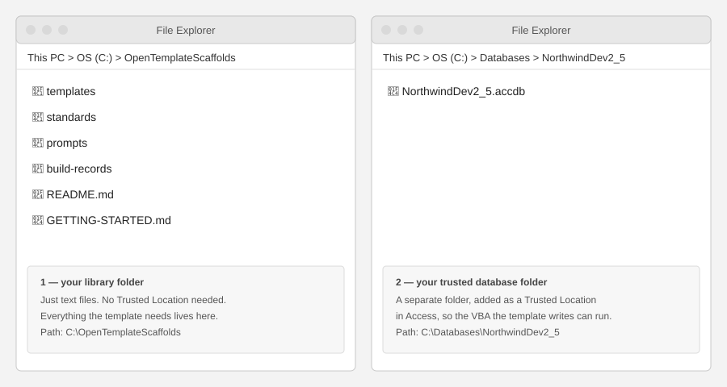
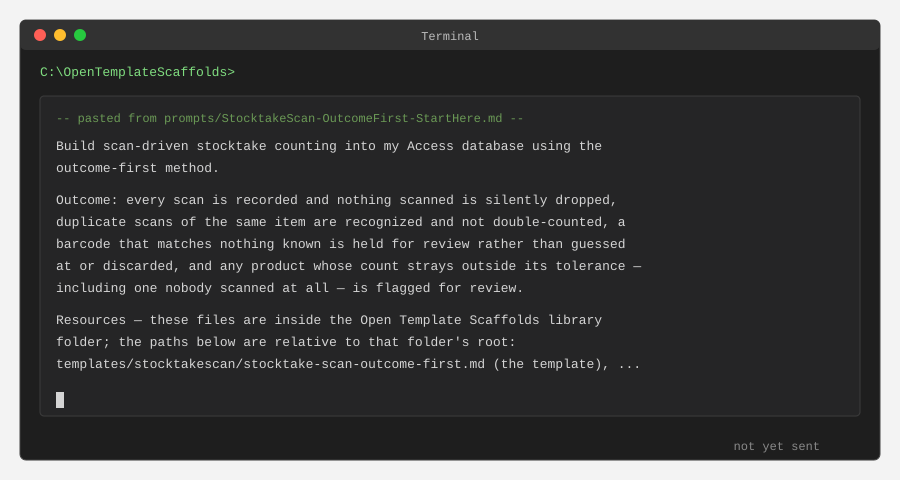

# Getting Started

**Who reads this:** anyone who wants to download Open Template Scaffolds and run their first build.

No installation. No account beyond an AI assistant you already have (or can get free —
see [`WELCOME.md`](WELCOME.md) if you don't have one yet).

## 1. Download the library

Click the green **Code** button above → **Download ZIP**, then unzip it somewhere you'll
find it again (your Documents folder is fine). If you use Git, you can fork and clone instead.

That unzipped folder is your copy of the library — everything you need is inside it.

## 2. Trust a folder for the database

Templates work by having Access run VBA code, so the database the template creates needs to
sit in a Trusted Location. (The library folder itself is just text files — it needs no
trust setting.)

In Access: **File → Options → Trust Center → Trust Center Settings → Trusted Locations →
Add new location**, then choose the folder your database will go in.

## 3. Open the library folder in your AI assistant

How you do this depends on which assistant you use:

- **Built into a code editor** (Claude Code, GitHub Copilot in VS Code): open the library
  folder in the editor. Done.
- **A chat assistant that can read files on your computer** (Claude Desktop with folder
  access): tell it the full path — *"My template library is in
  `C:\Users\<yourname>\Documents\OpenTemplateScaffolds`. Read what you need from there."*
- **A chat assistant in a browser** (Claude or ChatGPT on the web): skip to step 4, choose a
  prompt and paste that whole file into the chat. The assistant will tell you,
  by name, which other files it needs — open, copy, and paste each one in.

## 4. Pick a prompt and send it

Open the [`prompts/`](prompts/) folder. Each file there is a sample prompt — a starting point for a particular kind of build, not something you have to follow word for word. We crafted them after reviewing results of our own trial runs. We think they'll help you get started on the right foot.

Every prompt does two things:

- **states the outcome** — what you want built, in plain words
- **guides the template toward a good build** — your standards, who the build is for, and
  any extra options

Open the prompt closest to what you want to build. For your first trial, you can copy the **whole** file into your assistant. The prompts are editable; you might want to experiment with different wording as you become more familiar with the OTS method.

## 5. Review the design, then see what happens to it

Your assistant produces the design it proposes to build for the database it will deliver, along with a diagram of the tables and a field list when appropriate. Approve the proposal, or say what to change. Go through as many rounds as you need to get the result you want.

**What happens after you approve depends on one thing, and your assistant tells you which before it asks you anything.** If it has a tool connected that can open an Access file and build in it, it creates the tables for you and runs what it created, so that anything wrong is found and fixed before you see it. If it doesn't have that tool, the approved design is what you get, and you build from it yourself — the design is complete and yours to keep either way. `README.md` explains the tool under *About the two kinds of server*.

When it's done, read the record it writes of what was decided and what was built.

## Want to see it work first?

See **"A worked example for the quick start demo"** in [`README.md`](README.md) — a filled-in
prompt and the tables it produced, to compare against your own first result.

## Working on a database you already have?

This walkthrough covers your first build, using whichever sample prompt in `prompts/` fits what
you want to build. To add a template's tables, VBA, forms, or reports to a database you already
have, instead of starting fresh, see **"Ready to work on a database you already have?"** in
[`README.md`](README.md).
